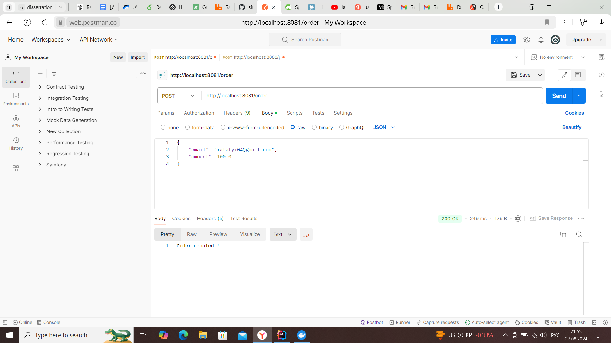
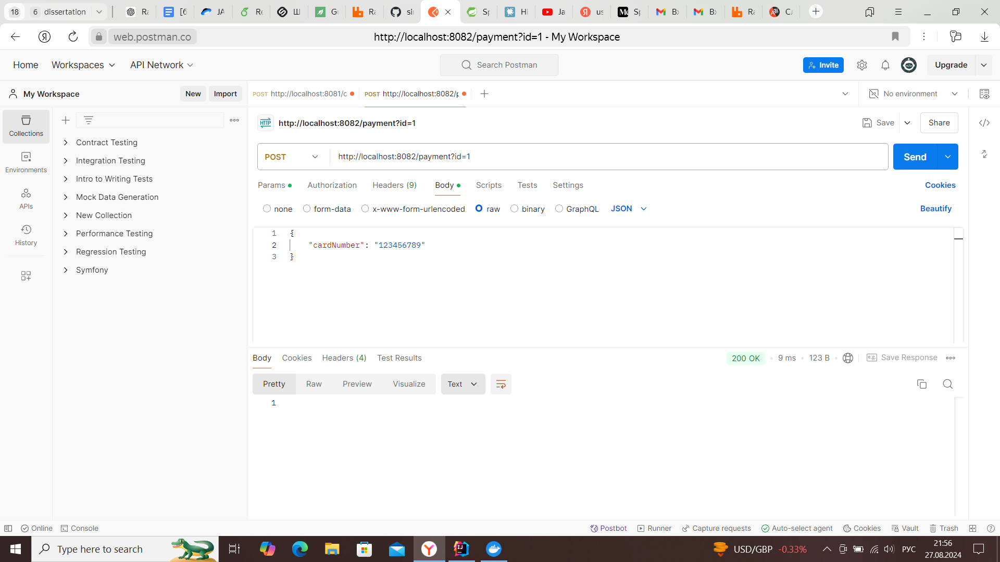

# Order and Payment System

Этот проект представляет собой микросервисную архитектуру, включающую четыре сервиса: Core, Mailing, Order и Payment. Эти сервисы взаимодействуют друг с другом и с клиентами через HTTP и RabbitMQ, который используется в качестве брокера сообщений.

## Описание сервисов

### 1. Core Service
- **Описание**: Сервис используется для работы с базой данных.

### 2. Mailing Service
- **Описание**: Сервис, отвечающий за отправку писем пользователям.
- Отправка писем при создании заказа или его оплате.

### 3. Order Service
- **Описание**: Принимает HTTP запросы по ресурсу `/order` и отвечает за создание заказа на определенную сумму.
- **Ресурсы**:
    - `POST /order` - Создание заказа. Принимает в теле запроса параметры `amount` и `email`.
- **Процесс**: При создании заказа отправляет сообщение в Core для сохранения заказа. После успешного создания заказа отправляет письмо с информацией.

### 4. Payment Service
- **Описание**: Принимает HTTP запросы по ресурсу `/payment` и отвечает за оплату заказа.
- **Ресурсы**:
    - `POST /payment` - Оплата заказа. Принимает в теле запроса параметр `card_number` и в параметрах запроса `id` заказа.
- **Процесс**: При оплате заказа отправляет сообщение в Core для проверки существования заказа. В случае отсутствия заказа возвращает ошибку. После успешной оплаты отправляет письмо с информацией о заказе.

## Запуск проекта

### Предварительные требования

- Docker Desktop должен быть установлен на вашей машине.

### Шаги запуска проекта

1. **Клонируйте репозиторий**:

   ```bash
   git clone <URL вашего репозитория>
   cd <название папки репозитория>
   
2. **Настройте необходимую конфигурацию**:
    1. Сервис core: Создайте базу данных orderdb, user/pass = userdev, или измените необходимые конфигурации для подключения к бд в core\src\main\resources\application.yml и docker-compose.yml
    2. Сервис mailing: Чтобы настроить сервис Mailing для отправки писем через Gmail, вам потребуется сгенерировать "пароль приложения" в настройках безопасности Google.
       1. Войдите в свой аккаунт gmail google.
       2. Перейдите в раздел Настройки безопасности.
       3. Включите двухфакторную аутентификацию, если она еще не включена.
       4. Создайте "пароль приложения" (можно найти в поиске в разделе безопасность).
    2. Используйте gmail и его пароль в mailing\src\main\resources\application.yml

3. Сборка проекта и подготовка для Docker
    Выполните maven команды
    ```bash
    mvn clean package
    mvn package spring-boot:repackage
    ```
   После успешной сборки проекта можно приступать к запуску приложения в Docker
    В главной директории проекта (microservice-parent) выполните команду
    ```bash
    docker-compose up --build
    ```

### Тестирования проекта
Для тестирования запустите postman и выполните:
1. order сервис работает на порту 8081

2. payment сервис работает на порту 8082

3. Для просмотра информации RabbitMQ (созданных очередей) перейдите на http://localhost:15672 user/password: guest
4. Так же для понимания структуры обмена сообщений можно наблюдать за логами в консоли при выполнении запросов.


### Удачи с проектом !)